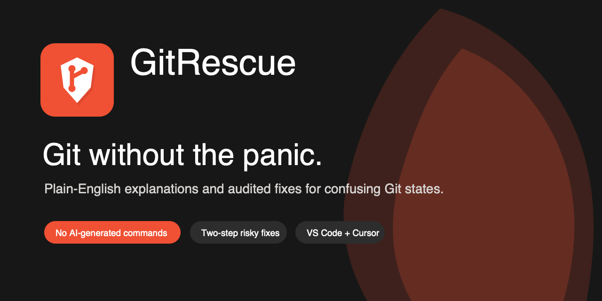

# GitRescue



**Git without the panic.**

GitRescue is a VS Code and Cursor extension that watches your repository for the
Git states that trip developers up: detached HEAD, merge conflicts, paused
rebases, diverged branches, stash conflicts, and pasted errors that read like a
threat.

When something goes wrong, GitRescue explains what happened in plain English and
offers a safe, audited next step. No terminal archaeology. No random commands
from a chatbot. No pretending Git syntax is obvious.

[Install from VS Code Marketplace](https://marketplace.visualstudio.com/items?itemName=rish106-hub.git-rescue)
or build the local VSIX with `npm run package`.

---

## Why GitRescue Exists

Git errors are not infinite. Most scary Git moments cluster around the same
small set of states:

- "You are in detached HEAD state"
- "Your local changes would be overwritten"
- merge conflict in progress
- rebase paused halfway through
- local and remote branches have diverged
- force push or undo-last-commit moments where one bad command can hurt

GitRescue treats those moments like product states, not puzzles. It detects the
state, explains the risk, and routes you to a fixed handler that was written and
tested deliberately.

## Built For

GitRescue is for developers who know what they want to do, but do not want to
memorize Git's failure modes:

- students learning Git
- junior developers working through real team workflows
- designers, PMs, and builders who code in VS Code or Cursor
- experienced developers who want guardrails around risky operations

It is not trying to replace the Git CLI for power users who already prefer raw
control.

## What It Does

### Auto-Detects Git Trouble

GitRescue watches `.git/` in real time. When your repo enters a known state, it
surfaces a plain-English prompt with the next safe action.

Examples:

- Detached HEAD -> create a branch to keep your commits reachable.
- Merge conflict -> list unresolved files, then complete the merge when ready.
- Rebase paused -> continue or abort after conflicts are resolved.
- Diverged branch -> show ahead/behind counts before offering pull-rebase.

### Ask GitRescue

One input box handles both intent and errors.

```text
undo my last commit
my branch is behind the remote
save this detached commit as a branch
fatal: refusing to merge unrelated histories
```

GitRescue classifies the request deterministically, then either explains the
error or routes to the matching audited handler.

### Explain a Git Error

Paste a Git error and GitRescue translates it into:

- what it means
- why it happened
- what to do next
- whether a live one-click fix is available in the current repo state

### Use the Sidebar

The GitRescue activity-bar panel gives you:

- quick actions
- current repo status
- detected problems
- activity log access


## Safety Promise

GitRescue's most important feature is restraint.

**It does not generate Git commands with AI. Ever.**

All fixes are fixed, audited handlers. The natural-language router can only
route to registered handler IDs; it cannot invent commands.

| Fix type | Example | Confirmation |
|---|---|---|
| Safe | stash changes, continue rebase, create branch | one confirmation |
| Destructive | `git reset HEAD~1`, `git push --force-with-lease` | two-step confirmation |

Destructive confirmations show the exact command before anything runs.

## Covered Git Situations

| # | Situation | GitRescue action | Safety |
|---|---|---|---|
| h1 | Detached HEAD | Create a branch to save commits | safe |
| h2 | Merge conflict | Report conflicts or complete merge | safe |
| h3 | Rebase paused | Continue or abort rebase | safe |
| h4 | Local changes would be overwritten | Stash or discard with confirmation | mixed |
| h5 | Undo last commit | `git reset HEAD~1`, keeping changes | destructive |
| h6 | Stash pop conflict | Report conflicted files and guide resolution | safe |
| h7 | Cherry-pick paused | Continue or abort cherry-pick | safe |
| h8 | Branch diverged from remote | `git pull --rebase` after confirmation | advisory |
| h9 | Force push | `git push --force-with-lease` | destructive |
| h10 | Branch far behind remote | Advisory warning | advisory |

Command-only handlers like undo and force push are never auto-detected.

## Commands

| Command | What it does |
|---|---|
| `GitRescue: Ask` | One box for plain-English intent or pasted errors |
| `GitRescue: Explain a Git Error` | Translate a Git error into next steps |
| `GitRescue: Check Repository Now` | Run a manual detection sweep |
| `GitRescue: Undo Last Commit` | Two-step confirmed reset that keeps changes |
| `GitRescue: Force Push (safe)` | Two-step confirmed force-with-lease |
| `GitRescue: View My Fixes` | List active auto-detection handlers |
| `GitRescue: View Activity Log` | Show local fix history |
| `GitRescue: Clear Activity Log` | Clear local fix history |

## Settings

| Setting | Default | What it controls |
|---|---|---|
| `gitrescue.autoDetect` | `true` | Watch the repo and show prompts automatically |
| `gitrescue.disabledHandlers` | `[]` | Disable handler IDs, such as `["h8-branch-diverged"]` |
| `gitrescue.confirmSafeFixes` | `true` | Ask before safe fixes; destructive fixes always ask twice |
| `gitrescue.telemetry` | `true` | Store local-only handler history; nothing is sent anywhere |

## Brand Assets

The GitRescue mark combines a Git branch graph with a rescue shield: repository
state plus safety.

- Marketplace icon: `media/icon.png`
- Vector icon: `media/gitrescue-icon.svg`
- Horizontal logo: `media/gitrescue-logo-horizontal.svg`
- Marketplace banner: `media/gitrescue-marketplace-banner.svg`
- Product Hunt card: `media/gitrescue-product-hunt-card.svg`
- PNG exports: `media/png/`

See [docs/brand-assets.md](docs/brand-assets.md) for palette and usage notes.

## Architecture

```text
src/
  extension.ts      activate(): registers sidebar, commands, detection
  detection.ts      FSWatcher, debounce, re-entrancy guard, activation sweep
  handlers.ts       10 audited handlers implementing the Handler interface
  git.ts            execFile wrappers; no shell interpolation
  ui.ts             confirmations, quick-picks, status bar, output channel
  errorMap.ts       curated Git error explanations
  explainer.ts      pasted error -> explanation + live fix lookup
  classifier.ts     deterministic keyword classifier
  nlRouter.ts       intent/error routing plan
  treeView.ts       GitRescue sidebar provider
  config.ts         settings reader
  telemetry.ts      local-only activity log
```

Key invariants:

- All Git commands use `child_process.execFile` with an args array.
- Destructive handlers always go through `confirmDestructive()`.
- Detection has a re-entrancy guard; no overlapping detection cycles.
- Missing `.git/` state files are treated as absent state, not fatal errors.
- The natural-language classifier is deterministic and offline.
- Every error-map `fixHandlerId` is integrity-checked against the handler
  registry in tests.

## Development

```bash
npm install
npm run dev
# Press F5 in VS Code to open the Extension Development Host.
```

Useful commands:

```bash
npm run gen:icon
npm run test:unit
npm run test:realgit
npm run test:integration
npm run build
npm run package
```

Real-git tests spawn actual temporary repositories and assert detection against
real `.git` state. Integration tests launch a headless VS Code extension host and
verify command registration.

## Publishing

The Marketplace package is `rish106-hub.git-rescue`.

See [docs/publishing.md](docs/publishing.md) for `VSCE_PAT` setup. Once the
authorized token exists:

```bash
npm version patch
npm run package
npx vsce publish --packagePath git-rescue-<version>.vsix -p <AUTHORIZED_VSCE_PAT>
```

## License

MIT
